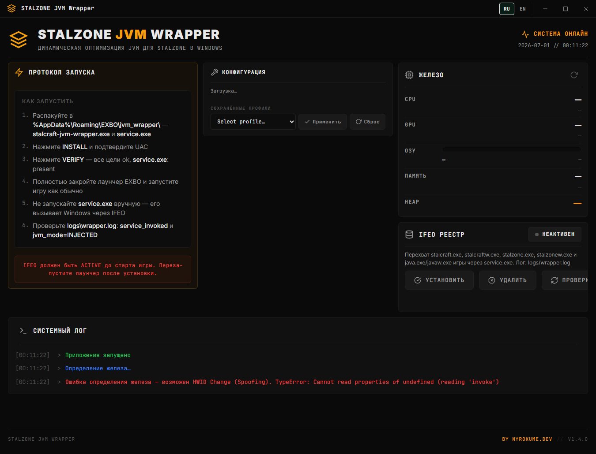
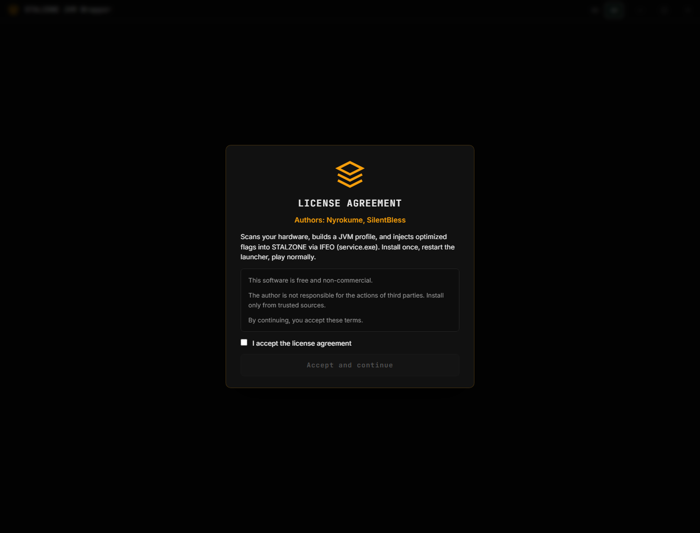
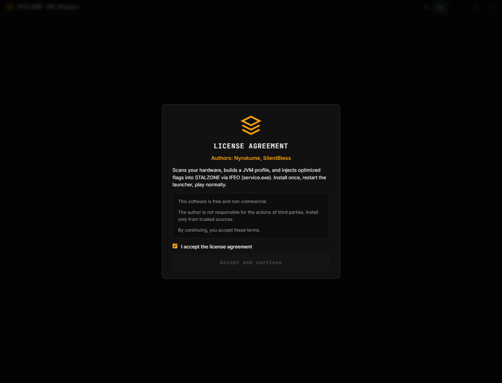

# STALZONE JVM Wrapper

Tauri/Rust port of [EXBO-Community/stalcraft-jvm-optimization](https://github.com/EXBO-Community/stalcraft-jvm-optimization) for **STALZONE** (EXBO launcher).

**Latest release:** [v1.5.5](https://github.com/Nyrokume/Stalcraft-JVM-Flag-fix/releases/latest) · `wrapper.zip`

## Screenshots

| Main UI | License (step 1) | Authors & contacts (step 2) |
|---|---|---|
|  |  |  |

## Layout

```
%AppData%\Roaming\EXBO\jvm_wrapper\
  stalcraft-jvm-wrapper.exe   ← GUI / installer (filename unchanged)
  service.exe                 ← IFEO debugger (required)
  configs\default.json
  logs\wrapper.log
  examples\                   ← JVM presets (copy to configs\ or import in UI)
```

## IFEO targets

| Image | Behavior |
|-------|----------|
| `stalzone.exe`, `stalzonew.exe`, `stalcraft.exe`, `stalcraftw.exe` | Always inject JVM flags |
| `java.exe`, `javaw.exe` | Inject only under `\runtime\stalcraft\` or `\exbo\` |

Registry: native 64-bit + WOW6432Node.

## Quick start

1. Add `%AppData%\Roaming\EXBO` to antivirus exclusions.
2. Download **`wrapper.zip`** from [Releases](https://github.com/Nyrokume/Stalcraft-JVM-Flag-fix/releases) (recommended) or build locally: `npm run build:prod`.
3. Extract to `%AppData%\Roaming\EXBO\jvm_wrapper\` (both `.exe` files side by side).
4. Launch GUI:
   - **Step 1:** accept license agreement
   - **Step 2:** authors & contacts screen → **Got it**
5. Click **INSTALL** (UAC) → **VERIFY** (all targets `ok`).
6. Fully restart EXBO launcher → play STALZONE.
7. Check `logs\wrapper.log` → `service_invoked` → `jvm_mode=INJECTED`.

**Do not run `service.exe` manually.**

## Server Blocker (v1.5.4)

Second tab in the app: ping 77 game tunnels, auto-best per region, block unwanted servers.

| Topic | Detail |
|-------|--------|
| **Current method** | Windows Firewall outbound rules on ports **29450–29460** (UAC required) |
| **Not used** | WinDivert on the client — conflicts with ExitLag/GearUP |
| **Planned** | Server-side MITM via `backend-*.stalzone` + `/address_list` API |
| **First visit** | Warning modal explains firewall, booster risk, and roadmap |
| **After ping** | Servers with ping >200 ms or unreachable are hidden and auto-blocked |

Architecture plan: [docs/server-blocker-architecture-ru.md](docs/server-blocker-architecture-ru.md)

## JVM presets (EXBO)

Shipped in `examples/` inside `wrapper.zip`:

| Preset | Source |
|--------|--------|
| `balanced_mid` | EXBO v1.1.1+ mid DDR tier |
| `slow_ddr` | EXBO v1.1.1+ slow DDR |
| `throughput_v110` | EXBO v1.1.0 mainstream |
| `x3d_v110` | EXBO v1.1.0 X3D / big L3 |
| `8khz` | Official EXBO high-end / 8 kHz mouse |
| `removed_fast_ddr` | Removed fast DDR tier (experimental) |

Import presets from the **CONFIGURATION** panel (chips) or copy JSON to `configs\`.

## Features (v1.5.4)

- [EXBO v1.1.2](https://github.com/EXBO-Community/stalcraft-jvm-optimization/releases/tag/v1.1.2) JVM generate parity
- Server Blocker GA: 77 servers, ping, auto-best top-3/region, firewall blocking
- JVM preset library from EXBO release history
- Two-step startup: license + author info (once per install via localStorage)
- Hardware detection: CPUID, WMI, registry (multi-view)
- IFEO via `service.exe`, UAC install from GUI
- Custom app icon, orange scrollbars
- Authors: Nyrokume, SilentBless — GitHub / Discord / Telegram in app

## Build from source

```powershell
npm install
npm test          # JS + Rust + UI smoke
npm run build:prod
```

Creates `wrapper.zip` with `stalcraft-jvm-wrapper.exe`, `service.exe`, `examples/`.

```powershell
npm run screenshots   # optional: refresh docs/screenshots/
```

## CLI

```text
stalcraft-jvm-wrapper.exe --install
stalcraft-jvm-wrapper.exe --uninstall
stalcraft-jvm-wrapper.exe --status
stalcraft-jvm-wrapper.exe --sb-apply <ips>   # firewall block (admin)
stalcraft-jvm-wrapper.exe --sb-clear         # remove rules (admin)
```

## Authors & support

| Channel | Contact |
|---------|---------|
| GitHub | [Nyrokume](https://github.com/Nyrokume) |
| Discord | `@nyrokume` |
| Telegram | [@nyrokume](https://t.me/nyrokume) |
| In-game | **DementiyRezak** |

See [README_RU.md](./README_RU.md) for Russian.

**License:** free, non-commercial. Install only from trusted sources.
